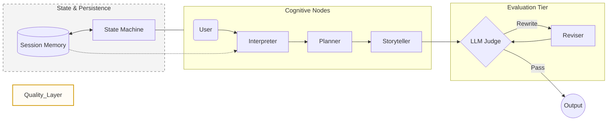

# Bedtime Story Studio

### A High-Fidelity Multi-Agent Framework for Research-Aligned Storytelling

Bedtime Story Studio is a specialized agentic pipeline designed to bridge the gap between pediatric cognitive research and generative AI. Unlike monolithic LLM prompts, this framework employs a **Stateful Orchestration** model, **Hierarchical Rubrics**, and **Session-based Memory** to ensure content is safe, low-arousal, and developmentally appropriate.

---

## Table of Contents

1. [Core Philosophy](https://www.google.com/search?q=%23core-philosophy)
2. [System Architecture](https://www.google.com/search?q=%23system-architecture)
3. [Technical Implementation](https://www.google.com/search?q=%23technical-implementation)
* [Stateful Orchestration](https://www.google.com/search?q=%23stateful-orchestration)
* [Hierarchical Evaluation](https://www.google.com/search?q=%23hierarchical-evaluation)
* [Observability and Telemetry](https://www.google.com/search?q=%23observability-and-telemetry)

4. [Future Roadmap](https://www.google.com/search?q=%23future-roadmap)
5. [Getting Started](https://www.google.com/search?q=%23getting-started)

---

## Core Philosophy

Generic LLMs often produce unpredictable results for children—excessive stimulation, poor structural closure, or subtle safety violations. This framework addresses these issues via:

* **Separation of Concerns**: Decoupling intent discovery, narrative planning, and creative execution.
* **Deterministic Control**: Utilizing a Finite State Machine (FSM) to manage agent transitions.
* **Research-to-Rubric**: Translating pediatric sleep hygiene and Self-Regulated Learning (SRL) principles into computable constraints.

---

## System Architecture

The architecture is designed for controllability and high-trust output. It features a closed-loop "Judge-Reviser" cycle supported by a persistent memory layer.



---

## Technical Implementation

### Stateful Orchestration

The system utilizes an explicit **Finite State Machine (FSM)**. Every session follows a governed lifecycle: `INIT` → `INTERPRETING` → `PLANNING` → `DRAFTING` → `JUDGING` → `FINALIZED`. This ensures:

* **Error Resilience**: The system can retry or resume from specific failure points.
* **Context Integrity**: Artifacts (Specs, Plans, Drafts) are persisted at each state transition.

### Hierarchical Evaluation

The **LLM-as-a-Judge** implementation uses a two-tier rubric:

* **Hard Safety Gates**: Non-negotiable binary checks (e.g., violence, stereotypes).
* **Soft Quality Scoring**: Multi-dimensional scoring (0-10) for **Low-Arousal**, **Age-Fit**, and **Narrative Closure**.

### Observability and Telemetry

Every session generates structured **Trace Logs**, enabling production-level monitoring:

* **Latency Tracing**: Performance benchmarking for individual agent nodes.
* **Convergence Rate**: Measuring the efficiency of the "Judge-Reviser" loop.

---


## Future Roadmap

* **Consensus-Based Judging**: Implementing multi-model voting (e.g., GPT-4 + Claude) to mitigate single-LLM bias.
* **Growth-Adaptive Memory**: Utilizing RAG to track a child's vocabulary development and adjust rubric difficulty.
* **Adversarial Red-Teaming**: Specialized agents designed to stress-test safety gates with edge-case prompts.

---

## Getting Started

### Prerequisites

* Python 3.9+
* OpenAI API Key

### Installation & Execution

```bash
# Clone the repository
git clone https://github.com/haoqi-shen/Story_studio.git
cd Story_studio

# Configure Environment
export OPENAI_API_KEY="your_api_key_here"

# Run the Framework
python main.py

```

### Output Artifacts

The framework persists data in the following locations for auditing and observability:

* **Session Data**: `story_studio/sessions/*.json` (Full state and trace data)
* **Event Logs**: `story_studio/logs/events.jsonl` (Structured telemetry for monitoring)
* **Preference Memory**: `story_studio/memory/user_prefs.json` (Long-term user profile)
